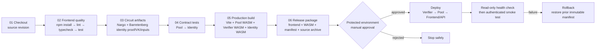

# MedKit CI/CD pipeline

The repository uses a sequential, fail-fast delivery pipeline. Every stage has
an explicit dependency on the stage before it; a failed quality gate prevents
contract builds and release packaging from running.

## Execution contract

`ci.yml` runs stages 01–06 for every push and pull request. The `needs` chain
is deliberate: `frontend` waits for `checkout`, `contracts` waits for
`circuits`, `circuits` waits for `frontend`, `build` waits for `contracts`, and
`package` waits for `build`.

The build stage produces the deployable frontend and Soroban WASM artifacts.
The package stage checks that the manifest, frontend bundle, contract WASM,
and source archive all exist and are non-empty before marking CI green.

`deploy.yml` is a manually dispatched, environment-scoped workflow. GitHub
Environment approvals and secrets remain outside the repository. Deployment
must publish the verifier before the pool, update the manifest only after RPC
confirmation, and finish with a read-only balance check plus an authenticated
deposit/claim smoke test. If validation fails, restore the previous immutable
contract manifest as documented in [`OPERATIONS.md`](OPERATIONS.md).

## Green criteria

- Frontend dependencies install reproducibly from the lockfile-aware package manifest.
- Lint, typecheck, frontend tests, and production build pass.
- Aid pool and identity contract tests pass.
- Identity proof, verification-key, and public-input artifacts are generated
  before the identity tests run.
- All three contract targets compile to `wasm32v1-none`.
- The release package contains the frontend, deployment manifest, WASM files,
  and reproducibility source archive.

No signing key is required by CI. Signing and chain mutation belong only to the
protected deployment environment.
